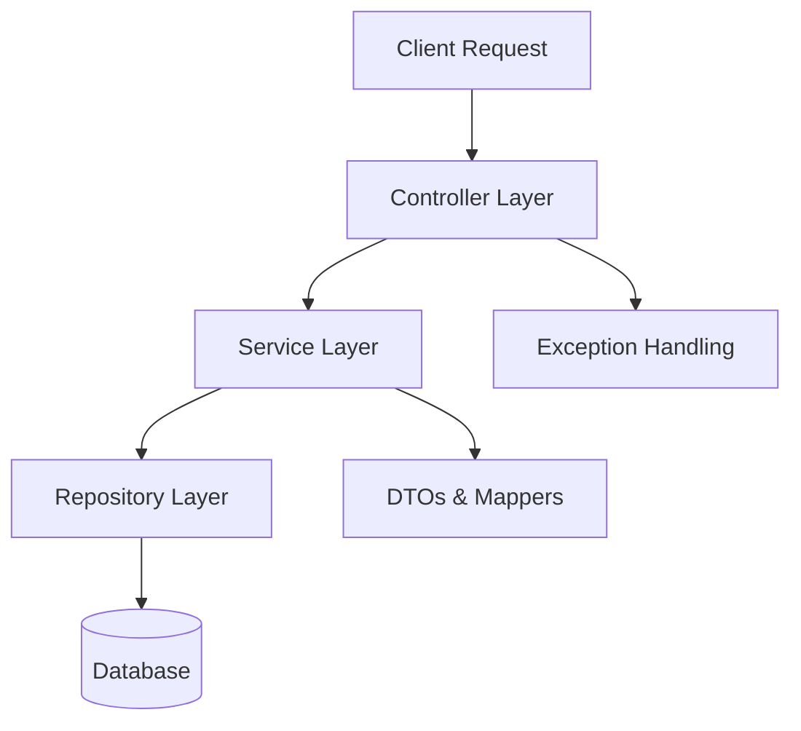
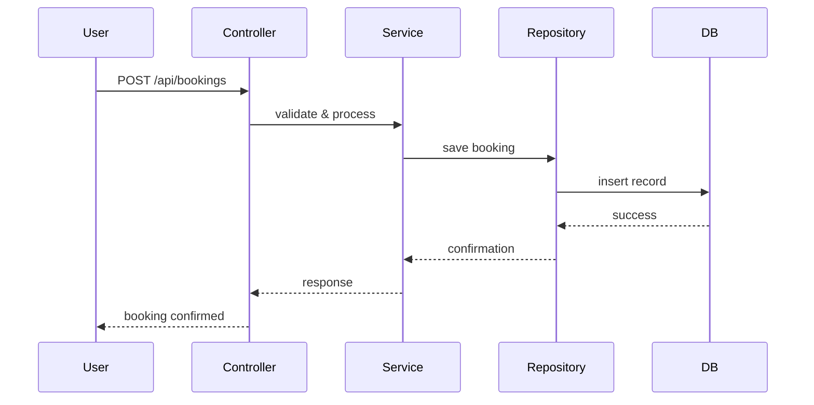

# 🏟️ FieldOps: Sports Infrastructure Management Backend

An enterprise-grade backend platform tailored for sports complexes, schools, and universities to manage **field bookings**, **maintenance schedules**, and **user operations**. Inspired by real-world systems used by turf platforms and stadium administrators, FieldOps is built with modularity, scalability, and clean architecture in mind.

---

## 🚀 Key Features

- 🗓️ **Booking Engine** – Reserve fields and courts with conflict-free scheduling
- 🧰 **Maintenance Scheduler** – Automate upkeep routines for optimal field conditions
- 👥 **Role-Based Access Control (RBAC)** – Admin, staff, and user segregation
- 📊 **Analytics Ready** – Extendable for usage reports and performance metrics
- 🧩 **Modular Architecture** – Clean separation of concerns across layers
- 🐳 **Docker-Ready** – Containerized deployment for consistent environments

---

## 🧱 Architecture Overview



# 🏟️ Sports Fields Management System

A modular Spring Boot backend project for managing sports field bookings, maintenance scheduling, user operations, and analytics reports.

---

## 📁 Project Structure

| Layer / Folder             | Purpose                                                             |
|---------------------------|---------------------------------------------------------------------|
| `Configs/`                | Application-level configurations                                   |
| `Controllers/`            | REST endpoints for booking, maintenance, and user operations       |
| `DTOs/`                   | Data Transfer Objects for request/response models                  |
| `Domain/`                 | Core business entities                                              |
| `Exceptions/`             | Custom exception classes                                            |
| `Mapper/`                 | Map domain models to DTOs and vice versa                           |
| `Repository/`             | Interfaces for data access                                          |
| `RepositoryServices/`     | Abstractions over repositories                                      |
| `Service/`                | Business logic interfaces                                           |
| `ServiceImplementation/`  | Concrete implementations of services                                |
| `Utils/`                  | Helper classes and utilities                                       |
| `FieldsmanagementsystemApplication.java` | Spring Boot entry point                        |

---

## 🐳 Docker Setup

### 1. `Dockerfile`

```dockerfile
FROM openjdk:17-jdk-slim
WORKDIR /app
COPY target/fieldsmanagementsystem-0.0.1-SNAPSHOT.jar app.jar
EXPOSE 8080
ENTRYPOINT ["java", "-jar", "app.jar"]
```
## 2. Build & Run
 # Build the image
docker build -t fieldops-backend .

# Run the container
docker run -p 8080:8080 fieldops-backend

📡 API Endpoints
| Resource    | Endpoint           | Method | Description              |
| ----------- | ------------------ | ------ | ------------------------ |
| Booking     | `/api/bookings`    | POST   | Create a new booking     |
| Maintenance | `/api/maintenance` | POST   | Schedule maintenance     |
| Users       | `/api/users`       | GET    | Fetch user details       |
| Reports     | `/api/reports`     | GET    | Generate usage analytics |

🔄 Booking Flow


## 🛠️ Tech Stack

- Java 17  
- Spring Boot  
- Maven  
- Docker  
- RESTful APIs  
- Clean Architecture Principles  

---

## 🧪 Running Locally

```bash
# Clone the repo
git clone https://github.com/Shubh00796/Sports-fields-management-system.git
cd Sports-fields-management-system

# Build the project
mvn clean install

# Run the app
java -jar target/fieldsmanagementsystem-0.0.1-SNAPSHOT.jar
```

🔧 Contribution Workflow
We follow a structured and consistent Git workflow to ensure clean history and seamless collaboration.

📂 Step 1: Fork the Repository
Click "Fork" on GitHub to create a personal copy of the project.

🌱 Step 2: Clone Your Fork
bash
git clone https://github.com/shubh00796/Sports-fields-management-system.git
cd your-forked-repo
🚀 Step 3: Create a Descriptive Feature Branch
bash
git checkout -b feat/add-user-auth
🧠 Branch naming convention: feat/ for new features fix/ for bug fixes refactor/ for code restructuring

🛠️ Step 4: Implement and Test Your Changes
Follow existing coding standards and naming conventions

Add necessary unit/integration tests

Ensure the app runs smoothly before committing

📦 Step 5: Stage and Commit Your Work
bash
git add .
git commit -m "feat(auth): add JWT-based login endpoint"
✅ Use Conventional Commits for clarity and changelog generation.

🔼 Step 6: Push Your Branch to GitHub
bash
git push origin feat/add-user-auth
📬 Step 7: Open a Pull Request (PR)
Go to your forked repo on GitHub

Click "Compare & pull request"

Add a clear, concise title (e.g., feat: Add JWT login)

Describe what the PR does and any relevant context

Link related issues using Closes #issue-number if applicable

👀 Step 8: Respond to Review Feedback
Maintain a collaborative tone and make revisions promptly. Use force-push if needed:

bash
git push --force-with-lease
🎉 Step 9: Merge and Celebrate
Once approved, your PR will be merged. Welcome aboard!
